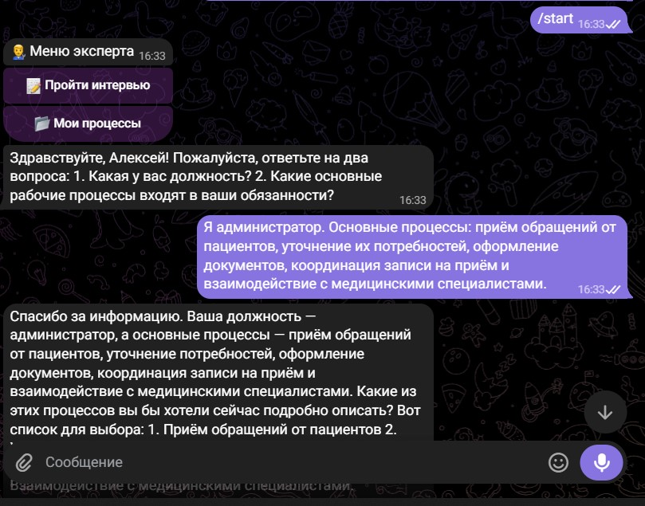
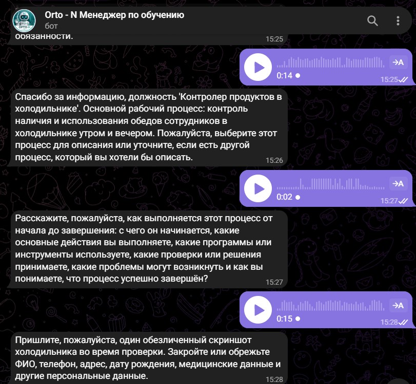
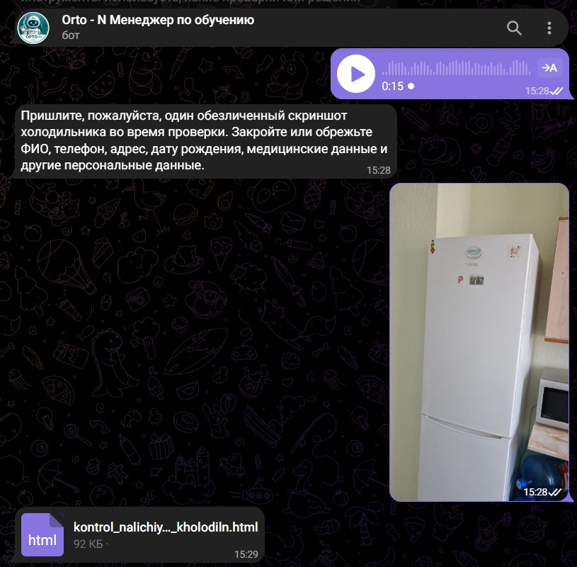
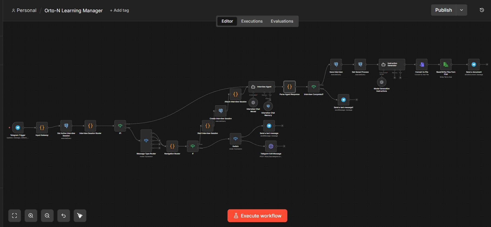
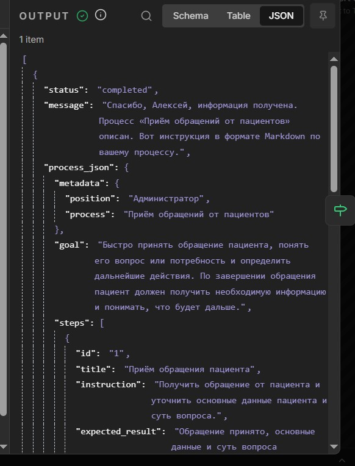
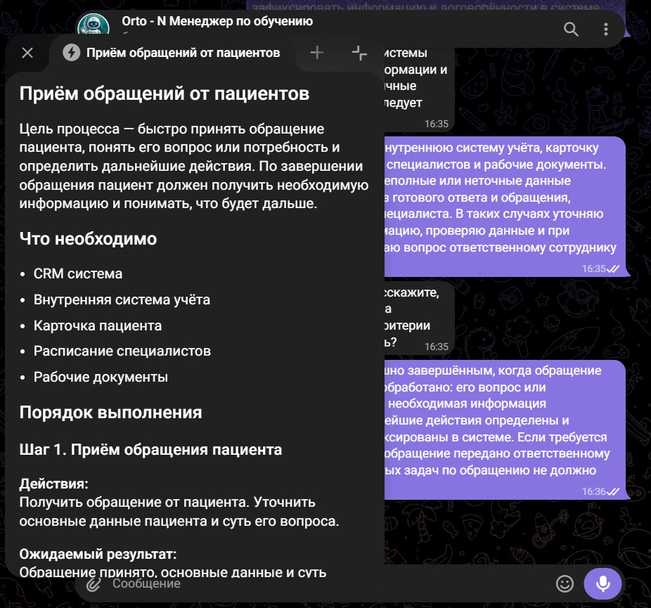

# Orto-N-L-M

> AI-система для обучения сотрудников и формирования базы знаний компании.

## О проекте

Orto-N-L-M собирает знания сотрудников через интервью и превращает их в структурированную базу знаний, на основе которой можно автоматически создавать обучающие материалы.

Проект разрабатываю самостоятельно: от архитектуры и проектирования workflow до интеграций, базы данных и развёртывания на VPS.

## Демонстрация

Типовой сценарий работы системы:

1. Сотрудник запускает интервью через Telegram.
2. AI проводит интервью и последовательно собирает информацию о рабочем процессе.
3. Сотрудник может отвечать **текстом или голосовыми сообщениями** — голос автоматически преобразуется в текст и передаётся в интервью.
4. AI при необходимости запрашивает **обезличенный скриншот или фотографию**, чтобы дополнить описание процесса визуальными материалами.
5. Полученная информация структурируется в Process JSON.
6. Данные сохраняются в PostgreSQL.
7. На основе Process JSON автоматически формируется обучающий материал.
8. Готовый результат передаётся пользователю через Telegram.

### Интервью в Telegram

AI проводит интервью и последовательно собирает информацию о рабочем процессе сотрудника.



### Голосовое интервью

Добавлена поддержка голосовых сообщений. Сотруднику не нужно каждый раз печатать длинные ответы: он может рассказать о процессе голосом, после чего система автоматически транскрибирует сообщение и продолжает интервью.

Это делает интервью быстрее и удобнее для сотрудников, особенно когда нужно подробно описать последовательность действий, используемые инструменты, проверки и типичные проблемы.



### Фото и скриншоты процесса

Во время интервью система может запросить обезличенный скриншот или фотографию, если визуальный материал помогает понять рабочий процесс.

Например, сотруднику предлагается показать оборудование, рабочее место или экран используемой системы. Перед отправкой бот отдельно предупреждает удалить или закрыть персональные и конфиденциальные данные.



### Workflow в n8n

Основная архитектура обработки данных, голосовых сообщений, фотографий и генерации результата.



### Process JSON

Структурированное представление знаний, которое используется как канонический источник данных.



### Готовая инструкция

Конечный обучающий материал, сформированный системой.



## Что уже сделано

- архитектура проекта;
- Telegram Input Gateway;
- маршрутизация сообщений;
- управление сессией интервью;
- Interview Agent;
- **голосовое анкетирование через Telegram**;
- **автоматическая транскрибация голосовых сообщений**;
- **загрузка и обработка фотографий и скриншотов**;
- запрос обезличенных визуальных материалов в нужный момент интервью;
- Process JSON;
- PostgreSQL;
- сохранение состояния интервью;
- генерация инструкции;
- формирование Markdown-файла;
- отправка готового результата пользователю в Telegram;
- развёртывание и отладка проекта на VPS;
- сквозное тестирование интервью с текстовыми, голосовыми и визуальными ответами.

## Архитектура

```text
Telegram
    ↓
Input Gateway
    ↓
Interview Session Router
    ↓
Message Type Router
    ├── Text / Callback
    │       ↓
    │   Interview Agent
    │
    ├── Voice
    │       ↓
    │   Telegram File
    │       ↓
    │   Speech-to-Text
    │       ↓
    │   Interview Agent
    │
    └── Photo / Screenshot
            ↓
        File Processing
            ↓
        Interview Agent

Interview Agent
    ↓
Process JSON
    ↓
PostgreSQL
    ↓
Knowledge Generator
    ↓
Instruction / Learning Material
    ↓
File
    ↓
Telegram
```

## Основной принцип

**Process JSON — единственный источник истины.**

Знания хранятся отдельно от их представления. AI используется для обработки информации и генерации материалов, а структурированные данные остаются каноническим источником, из которого можно создавать разные форматы обучающих материалов.

## Что сделал я

- спроектировал архитектуру системы;
- разработал workflow в n8n;
- реализовал логику интервью и управления сессиями;
- реализовал голосовой канал интервью и автоматическую транскрибацию;
- реализовал обработку фотографий и скриншотов как материалов интервью;
- спроектировал структуру Process JSON;
- настроил интеграцию с Telegram;
- настроил работу с OpenAI API;
- реализовал сохранение данных в PostgreSQL;
- реализовал генерацию обучающих материалов;
- настроил формирование и передачу файлов;
- развернул проект на VPS;
- провёл сквозное тестирование MVP и отладку основных сценариев.

## Стек

- Ubuntu Server 24.04 LTS
- Docker 29.6.1
- Docker Compose 2.39.x
- PostgreSQL 17.6
- pgvector 0.8.2
- n8n 2.29.10 Self Hosted
- OpenAI API
- Telegram Bot API
- JavaScript

## Статус

🚀 **MVP работает и прошёл сквозное тестирование.**

Система умеет проводить интервью через Telegram, принимать текстовые и голосовые ответы, автоматически транскрибировать голос, запрашивать фотографии и скриншоты процесса, сохранять структурированные знания и формировать готовый обучающий материал.

Проект продолжает развиваться в сторону расширения базы знаний, генераторов обучающих материалов, тестирования и AI Assistant.

## Автор

**Алексей Хорьяков**

AI Automation / AI Integration

[GitHub](https://github.com/AlekseyHorjakov)
