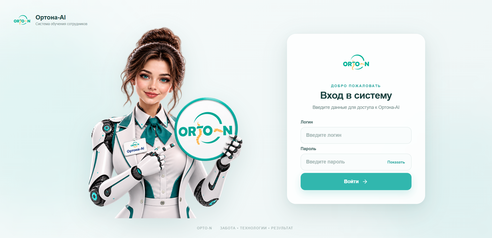
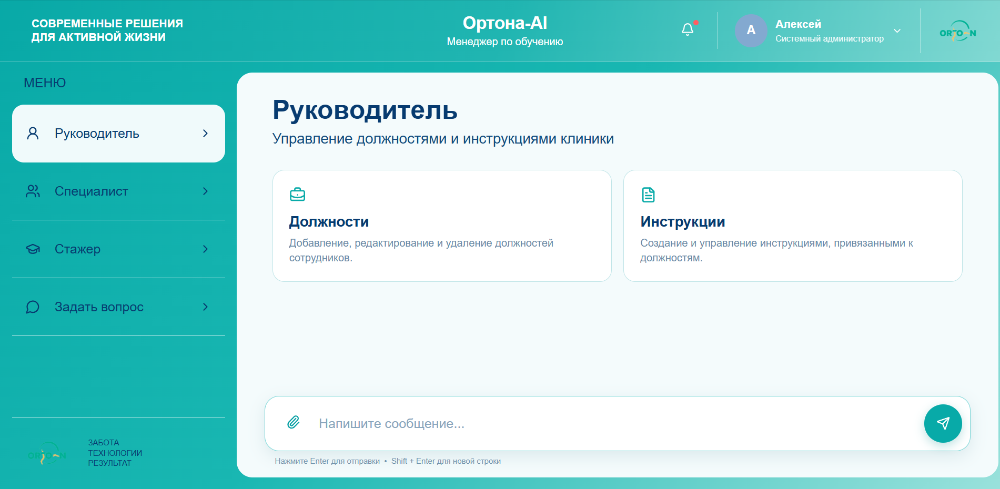
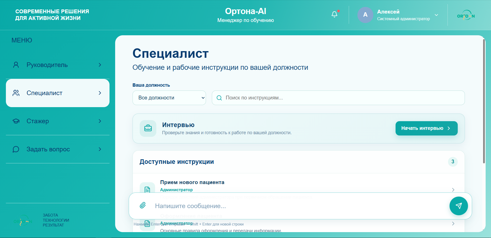
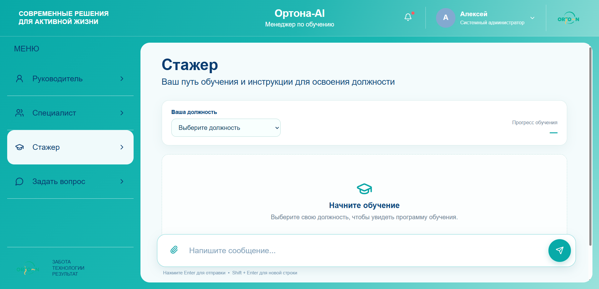
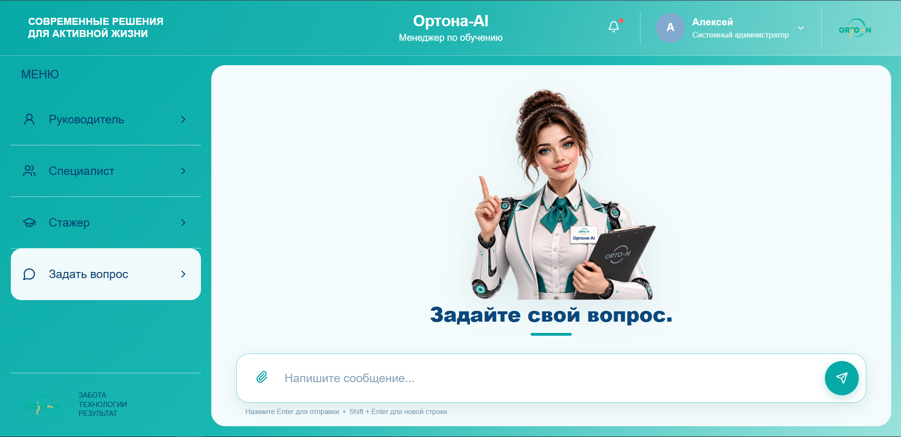

# Orto-N-L-M

> AI-система для обучения сотрудников, сбора экспертизы и формирования корпоративной базы знаний.

**Orto-N-L-M** — ядро системы, а **Ортона-AI** — её современный веб-интерфейс для сотрудников и руководителей.

Проект развивается от первоначального интерфейса через Telegram к полноценному веб-приложению. При этом основная бизнес-логика, структура знаний и принцип работы системы сохраняются: практическая экспертиза сотрудников превращается в структурированный **Process JSON**, который становится каноническим источником знаний для инструкций, обучения, тестирования и ответов AI.

---

## Что происходит с проектом сейчас

### Переход с Telegram на Web

Первоначальный рабочий контур системы был реализован через Telegram. Этот этап позволил проверить основную бизнес-логику: интервью специалиста, формирование Process JSON, работу руководителя с должностями и инструкциями, обучение стажёра и тестирование знаний.

Следующий этап — перенос пользовательского взаимодействия из Telegram в собственное веб-приложение **Ортона-AI**.

Telegram рассматривается как предыдущий интерфейс системы, а не как целевой пользовательский интерфейс.

Веб-интерфейс проектируется как единая рабочая среда для трёх ролей:

- **Руководитель** — управление должностями, процессами и инструкциями;
- **Специалист** — прохождение AI-интервью и передача экспертизы в систему;
- **Стажёр** — изучение инструкций и проверка знаний через тестирование.

Отдельный раздел **«Задать вопрос»** предназначен для работы сотрудника с AI по знаниям организации.

---

## Ортона-AI — веб-интерфейс системы

Веб-интерфейс спроектирован как самостоятельный продуктовый слой поверх существующего ядра Orto-N-L-M.

В интерфейсе уже реализованы основные пользовательские контуры:

```text
                         ОРТОНА-AI
                             │
        ┌────────────────────┼────────────────────┐
        │                    │                    │
   Руководитель          Специалист            Стажёр
        │                    │                    │
   Должности             Интервью             Инструкции
   Инструкции                │                    │
        │               Process JSON          Обучение
        │                    │                    │
        └────────────── PostgreSQL ──────────────┘
                             │
                        AI / n8n backend
                             │
                       Задать вопрос
```

### Спроектированы и реализованы

- единая визуальная система Ортона-AI;
- адаптивный веб-интерфейс;
- боковая навигация по ролям;
- интерфейс руководителя;
- управление должностями;
- управление инструкциями;
- интерфейс специалиста;
- AI-интервью специалиста;
- пошаговая структура интервью;
- интерфейс стажёра;
- изучение инструкций;
- тестирование знаний;
- отображение результата теста;
- повторное прохождение тестирования при неудовлетворительном результате;
- раздел «Задать вопрос»;
- общий чат-композер;
- визуальный AI-персонаж Ортона-AI;
- экран авторизации как основа будущей серверной аутентификации.

Текущая frontend-версия находится в:

`frontend/ortona-ai/`

Стек интерфейса:

- React;
- Vite;
- JavaScript;
- Lucide Icons;
- CSS;
- localStorage на текущем этапе прототипирования пользовательского состояния.

---

## Архитектура проекта

Проект разделён на несколько логических уровней:

```text
┌─────────────────────────────────────────────┐
│                 Ортона-AI Web               │
│       пользовательский интерфейс            │
└──────────────────────┬──────────────────────┘
                       │ API
┌──────────────────────▼──────────────────────┐
│                  n8n / Backend               │
│      маршрутизация, AI, бизнес-логика       │
└──────────────────────┬──────────────────────┘
                       │
┌──────────────────────▼──────────────────────┐
│                PostgreSQL                    │
│     пользователи, должности, процессы,      │
│       инструкции, сессии и знания           │
└──────────────────────┬──────────────────────┘
                       │
              ┌────────▼────────┐
              │   Process JSON  │
              │  источник знаний │
              └─────────────────┘
```

### Роли

#### Руководитель

Имеет полный доступ к функционалу системы в рамках своей роли:

- должности;
- инструкции;
- управление содержимым;
- контроль обучения сотрудников;
- дальнейшее управление процессами.

#### Специалист

Основная задача — передать системе собственную практическую экспертизу через AI-интервью.

Результат интервью — структурированный Process JSON, который сохраняется в базе и используется для дальнейшего формирования инструкций.

#### Стажёр

Работает с готовыми знаниями организации:

- выбирает должность;
- изучает инструкции;
- проходит тестирование;
- получает результат;
- при необходимости повторяет тест.

#### Задать вопрос

AI-интерфейс для получения ответов по рабочим знаниям системы.

---

## Главный принцип: Process JSON

**Process JSON — канонический источник знаний системы.**

AI не должен самостоятельно изменять факты, полученные от эксперта. Инструкции, тесты и другие производные представления строятся на основании структурированных данных процесса.

Пример структуры:

```json
{
  "metadata": {
    "interviewee": "",
    "role": "",
    "position": "",
    "employee_position": "",
    "process": ""
  },
  "goal": "",
  "steps": [
    {
      "id": "step1",
      "title": "",
      "instruction": "",
      "expected_result": "",
      "attachments": [],
      "exceptions": [],
      "tips": [],
      "notes": ""
    }
  ]
}
```

Этот принцип позволяет отделить **знания организации** от конкретного пользовательского интерфейса.

---

## Рабочие контуры, подтверждённые тестированием

### Специалист

Подтверждено:

- запуск интервью;
- полноценное адаптивное интервью;
- сбор содержательных ответов;
- запрос изображений/скриншотов при необходимости;
- обработка голосовых ответов и транскрибация;
- формирование Process JSON;
- сохранение процесса и должности в PostgreSQL;
- генерация инструкции;
- работа со списком процессов.

### Руководитель

В текущей логике предусмотрены:

- список должностей;
- добавление должности;
- редактирование названия;
- удаление с подтверждением;
- удаление связанных процессов/инструкций перед удалением должности;
- просмотр инструкций по должности;
- получение готовой инструкции без участия AI.

### Стажёр

Подтверждено:

- выбор должности;
- список инструкций;
- открытие инструкции;
- перевод инструкции в состояние «изучено»;
- активация тестирования после изучения;
- механическая проверка ответов;
- перемешивание вариантов ответа с сохранением правильного ответа;
- отображение процента результата;
- повторное прохождение теста при результате ниже проходного порога.

---

## Backend и текущая задача

Следующий технический этап — подключение веб-интерфейса к реальному backend вместо локального демонстрационного состояния.

В частности, необходимо реализовать:

- серверную аутентификацию;
- хранение пользователей в PostgreSQL проекта;
- безопасное хранение паролей только в виде хэшей;
- серверную авторизацию по ролям;
- API между Ортона-AI и backend;
- перенос пользовательского состояния из localStorage в серверную модель;
- подключение существующей бизнес-логики Orto-N-L-M к веб-интерфейсу.

Веб-интерфейс при этом не переписывается с нуля: задача backend-этапа — подключить уже спроектированный и работающий UI к реальной системе.

---

## Технологический стек

### Backend / инфраструктура

- Ubuntu Server 24.04 LTS;
- Docker;
- PostgreSQL;
- n8n **2.9.4 Self Hosted**;
- OpenAI API;
- `gpt-4.1-mini`;
- JavaScript.

### Frontend

- React;
- Vite;
- JavaScript;
- CSS;
- Lucide Icons.

---

## Структура репозитория

```text
Orto-N-L-M/
├── frontend/
│   └── ortona-ai/          # веб-интерфейс Ортона-AI
├── data/                   # данные проекта
├── docs/                   # документация
├── prompts/                # системные промпты
├── sql/                    # SQL и структура БД
├── .env.example
├── ARCHITECTURE_REVIEW.md
├── PROJECT.md
├── README.md
└── LICENSE
```

---

## Workflow

Рабочая backend-логика продолжает развиваться в n8n. Исторически пользовательский вход выполнялся через Telegram, но текущий продуктовый вектор — веб-интерфейс Ортона-AI.

Рабочие экспорты n8n не должны публиковаться в открытом репозитории вместе с действующими токенами, ключами и другими секретами.

Структура workflow, архитектурные решения и документация хранятся отдельно от секретов.

---

## Безопасность

Публичный репозиторий не должен содержать:

- API keys;
- пароли;
- Telegram Bot Token;
- session secrets;
- приватные credentials;
- другие чувствительные данные.

`.env.example` используется только как шаблон конфигурации.

---

## Roadmap

### Завершено

- [x] инфраструктура проекта;
- [x] основная backend-логика;
- [x] AI-интервью специалиста;
- [x] Process JSON;
- [x] работа руководителя с должностями и инструкциями;
- [x] контур стажёра;
- [x] тестирование знаний;
- [x] проектирование веб-интерфейса;
- [x] реализация интерфейса Ортона-AI;
- [x] подготовка frontend в репозитории.

### В работе

- [ ] серверная аутентификация;
- [ ] RBAC по ролям;
- [ ] API frontend ↔ backend;
- [ ] подключение PostgreSQL к веб-интерфейсу;
- [ ] перенос состояния из localStorage в backend;
- [ ] публикация веб-приложения.

### Далее

- [ ] RAG / векторный поиск;
- [ ] расширение AI-инструментов;
- [ ] расширение аналитики обучения;
- [ ] дальнейшее развитие веб-приложения.

---

## Скриншоты

### Ортона-AI — авторизация



### Руководитель



### Специалист



### Стажёр



### Задать вопрос



Актуальные изображения показывают текущий веб-интерфейс Ортона-AI. Исторические материалы Telegram сохранены отдельно как часть истории развития проекта.

## Автор

**Алексей Хорьяков**  
AI Automation / AI Integration

urlGitHubhttps://github.com/AlekseyHorjakov

